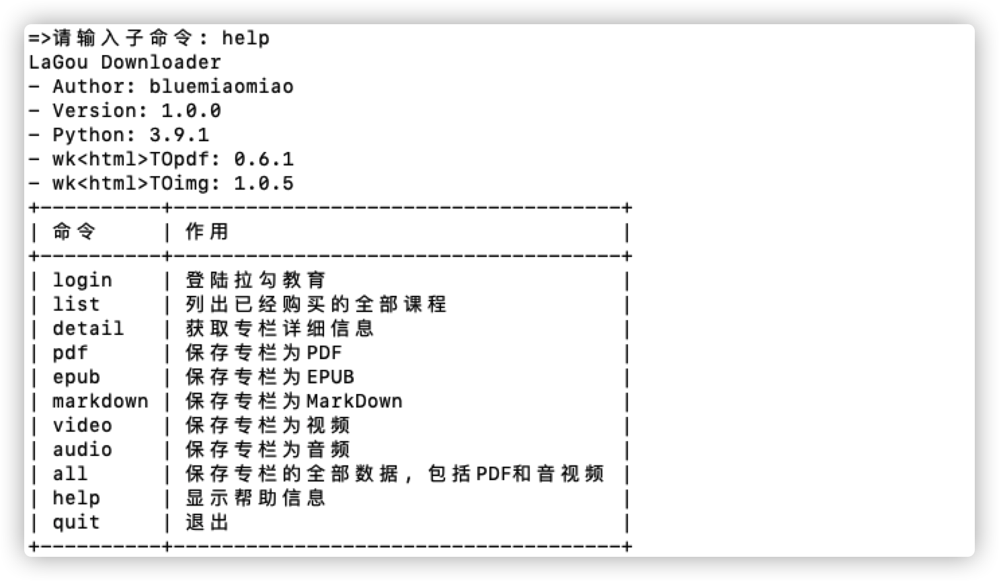
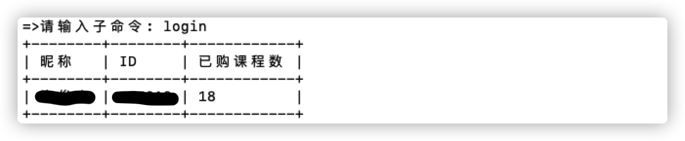
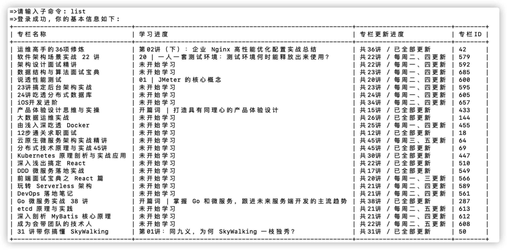

# lagou-downloader

> lagou-downloader是拉勾教育课程下载器, 支持PDF/视频/音频下载。

# 安装环境

lagou-downloader使用Python 3.x开发, 所以你应该具备`python3`和`pip3`指令。你可以到[Python官网下载中心](https://www.python.org/downloads/)下载到最新的Python版本。将lagou-downloader仓库Clone到本地:

```
git clone https://github.com/bluemiaomiao/lagou-downloader.git
cd lagou-downloader
```

接下来创建虚拟环境:

```
pip3 install virtualenv
virtualenv venv
```

然后安装依赖:

```
pip3 install -r requirements.txt
```

# 配置文件

`config.ini`是lagou-downloader的配置文件, 主要针对下载器核心的配置是`app`区块:

- `request_freq`用来设置每个资源请求的频率, 默认5秒每个资源, 如果你有足够的资金, 可以购买代理池, 将该值设置为-1, 那么lagou-downloader将会不限制速率

- `cookie`是登录后整个Cookie的Base64编码, 可以使用[此网站](https://base64.us)进行编解码

# 命令解释

## help

显示帮助信息, 当在你输入错误命令的时候, 也会显示帮助信息。



## login

登录到拉勾教育。



## list

登录后可以列出购买的全部课程, 试读课程也会列出来。



## quit & Control-C(Ctrl+C)

退出下载器, lagou-downloader会自动将未完成的任务保存app.dat文件, 下次启动lagou-downloader将会提示是否进行未完成的任务。


